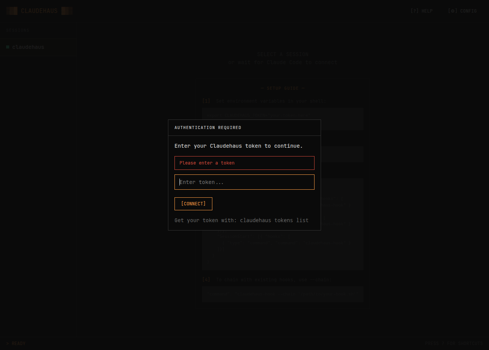
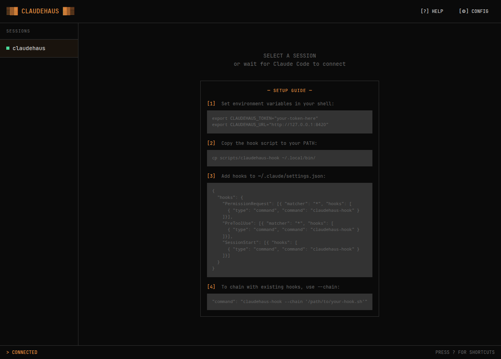
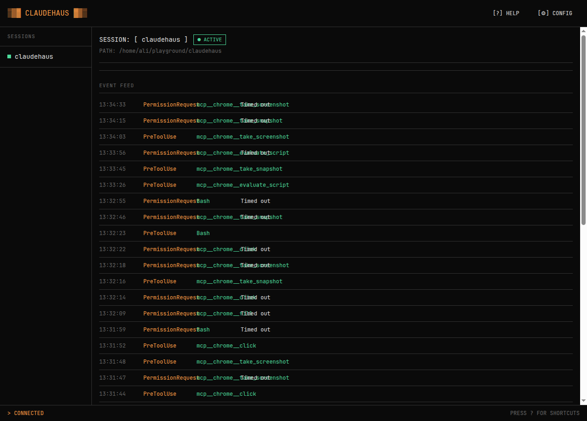
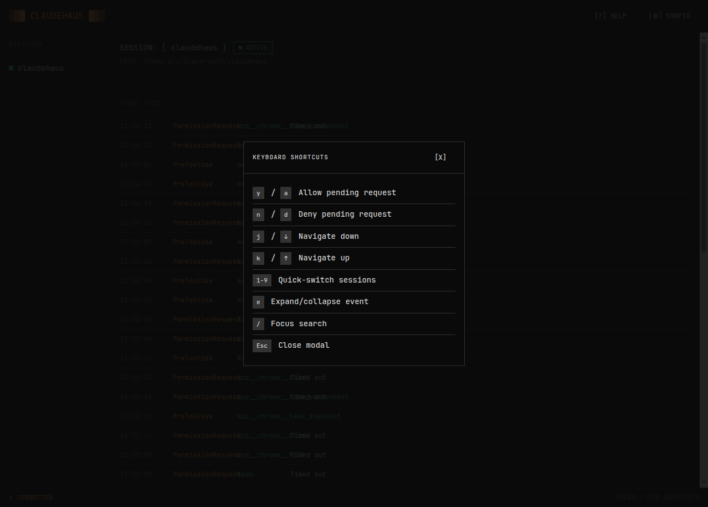

# CLAUDEHAUS

> A self-hosted web dashboard for monitoring and controlling multiple Claude Code instances in real-time.



## Features

- **[Real-time Monitoring](#session-detail-view)** - Live event feed showing all Claude Code activity (tool usage, file operations, etc.)
- **[Permission Control](#permission-approvals)** - Approve or deny permission requests directly from the web UI
- **Multi-Session Support** - Monitor and switch between multiple Claude Code sessions
- **Token Authentication** - Secure access with unique tokens for each device
- **No External Dependencies** - Single binary with embedded assets, JSON file storage
- **Brutalist Design** - "Fenko" aesthetic matching the command-line experience

## Quick Start

### 1. Install

```bash
go install github.com/aliadnani/claudehaus/cmd/claudehaus@latest
```

Or build from source:

```bash
git clone https://github.com/aliadnani/claudehaus.git
cd claudehaus
go build ./cmd/claudehaus
```

### 2. Start the Server

```bash
./claudehaus
```

First run will display your authentication token and setup instructions:

```
╔══════════════════════════════════════════════════════════════════════════════╗
║  CLAUDEHAUS FIRST RUN                                                        ║
╠══════════════════════════════════════════════════════════════════════════════╣
║                                                                              ║
║  1. Save this token:                                                         ║
║     d869b9d53b8bb7c3e21083fbbb9414ad71b8bafffa996a69a5843e11a746e916         ║
║                                                                              ║
║  2. Set environment variables:                                               ║
║     export CLAUDEHAUS_TOKEN="d869b9d53b8bb7c3e21083fbbb9414ad71b8bafffa996a69a5843e11a746e916"   ║
║     export CLAUDEHAUS_URL="http://127.0.0.1:8420"                            ║
║                                                                              ║
║  ...
╚══════════════════════════════════════════════════════════════════════════════╝
```

### 3. Configure Claude Code Hooks

Add to `~/.claude/settings.json`:

```json
{
  "hooks": {
    "PermissionRequest": [{
      "matcher": "*",
      "hooks": [{
        "type": "command",
        "command": "claudehaus-hook"
      }]
    }],
    "PreToolUse": [{
      "matcher": "*",
      "hooks": [{
        "type": "command",
        "command": "claudehaus-hook"
      }]
    }],
    "SessionStart": [{
      "hooks": [{
        "type": "command",
        "command": "claudehaus-hook"
      }]
    }]
  }
}
```

### 4. Install the Hook Script

```bash
cp scripts/claudehaus-hook ~/.local/bin/
```

### 5. Open the Web UI

Navigate to `http://127.0.0.1:8420` and authenticate with your token.

## Usage

### Dashboard



The main dashboard shows:
- **Session List** (left sidebar) - All active Claude Code sessions
- **Setup Guide** (main area) - Instructions when no session is selected

### Session Detail View

Click any session to view:
- **Session Info** - Project path, status, nickname
- **Pending Approvals** - Permission requests awaiting your decision
- **Event Feed** - Real-time log of tool usage and events



### Permission Approvals

When Claude Code requests permission (e.g., to run a shell command), a pending approval card appears:

- **[Y] ALLOW** - Approve the request
- **[N] DENY** - Deny the request
- Timeout countdown shows remaining time

Keyboard shortcuts: `y`/`a` to allow, `n`/`d` to deny.

### Keyboard Shortcuts



| Key | Action |
|-----|--------|
| `y` / `a` | Allow pending request |
| `n` / `d` | Deny pending request |
| `j` / `↓` | Navigate down |
| `k` / `↑` | Navigate up |
| `1-9` | Quick-switch sessions |
| `e` | Expand/collapse event |
| `/` | Focus search |
| `?` | Show help |
| `Esc` | Close modal |

## Token Management

### List Tokens

```bash
./claudehaus tokens list
```

### Create New Token

```bash
./claudehaus tokens create "my-laptop"
```

### Revoke Token

```bash
./claudehaus tokens revoke <token-id>
```

## Configuration

Settings are stored in `~/.claudehaus/config.json`:

```json
{
  "server": {
    "host": "127.0.0.1",
    "port": 8420
  },
  "settings": {
    "approval_timeout_seconds": 300,
    "approval_timeout_behavior": "passthrough"
  },
  "tokens": [...],
  "sessions": {...}
}
```

### Timeout Behavior

When approval requests timeout:
- `passthrough` - Continue without response (default)
- `allow` - Auto-approve
- `deny` - Auto-deny

## Hook Chaining

Chain with existing hooks using `--chain`:

```json
{
  "hooks": {
    "PermissionRequest": [{
      "hooks": [{
        "type": "command",
        "command": "claudehaus-hook --chain '/path/to/your-hook.sh'"
      }]
    }]
  }
}
```

## How It Works

```
┌─────────────┐     hooks      ┌────────────────┐
│  Claude     │───────────────>│ claudehaus-hook│
│   Code      │                └────────────────┘
└─────────────┘                         │
                                         ▼
                                  ┌─────────────┐
                                  │  claudehaus │
                                  │   server    │
                                  └──────┬──────┘
                                         │
                                  ┌──────▼──────┐
                                  │   Browser   │
                                  │   (HTMX)    │
                                  └─────────────┘
```

1. **Claude Code** executes hooks (PreToolUse, PermissionRequest, etc.)
2. **claudehaus-hook** forwards events to the server via HTTP
3. **claudehaus** processes events, stores them, and broadcasts via WebSocket
4. **Browser** receives real-time updates and refreshes the UI

## Tech Stack

- **Go 1.25+** - Single binary, no CGO dependencies
- **HTMX 2.0+** - Dynamic UI updates without JavaScript frameworks
- **WebSocket** - Real-time event streaming
- **Gorilla WebSocket** - WebSocket library
- **JSON** - Configuration and data persistence
- **Fenko CSS** - Brutalist design system

## Development

```bash
# Run
go run ./cmd/claudehaus

# Build
go build ./cmd/claudehaus

# Run tests
go test ./...
```

## Screenshots

| Login | Dashboard | Session Detail |
|-------|-----------|----------------|
|  |  |  |

## License

MIT
